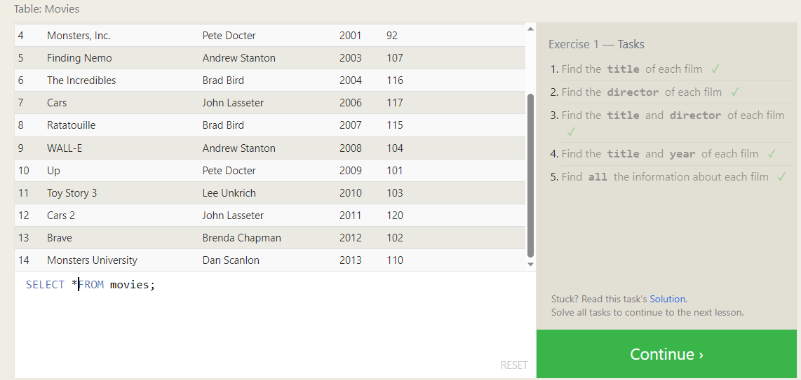
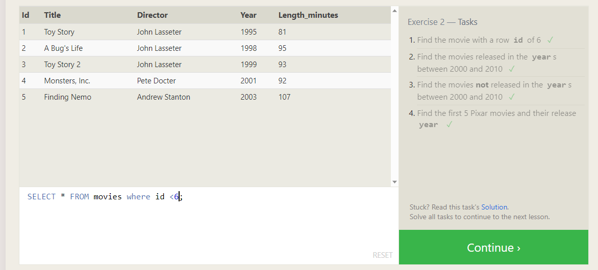
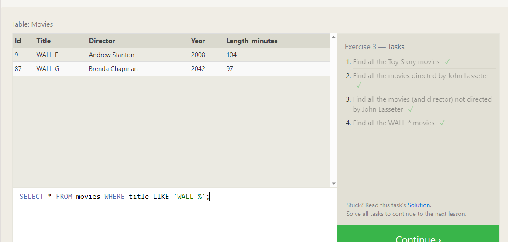
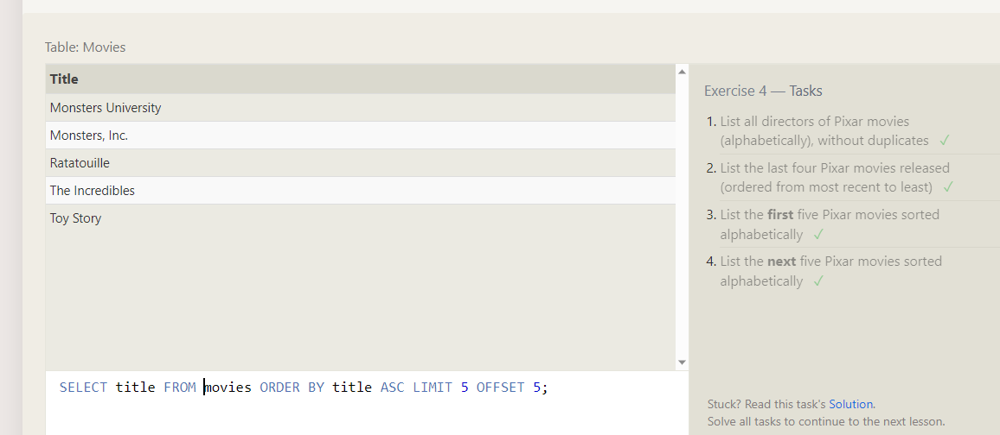
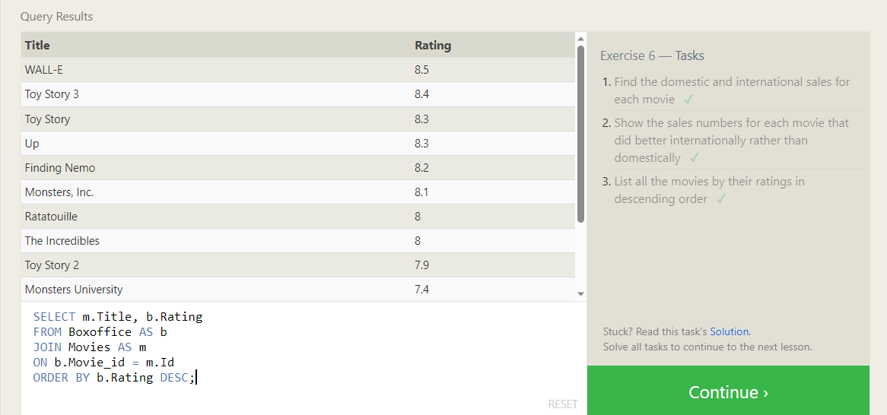
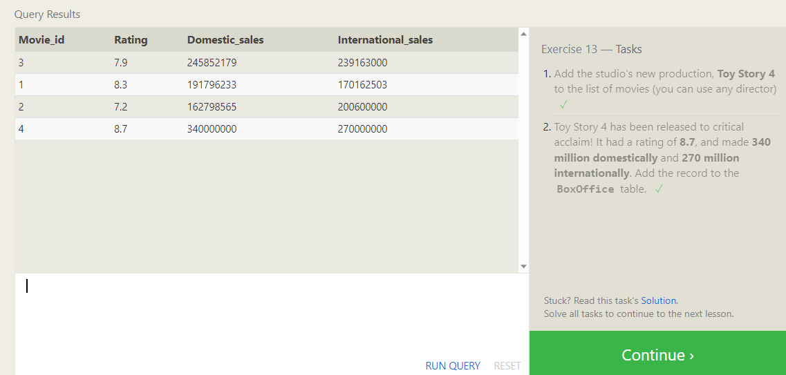
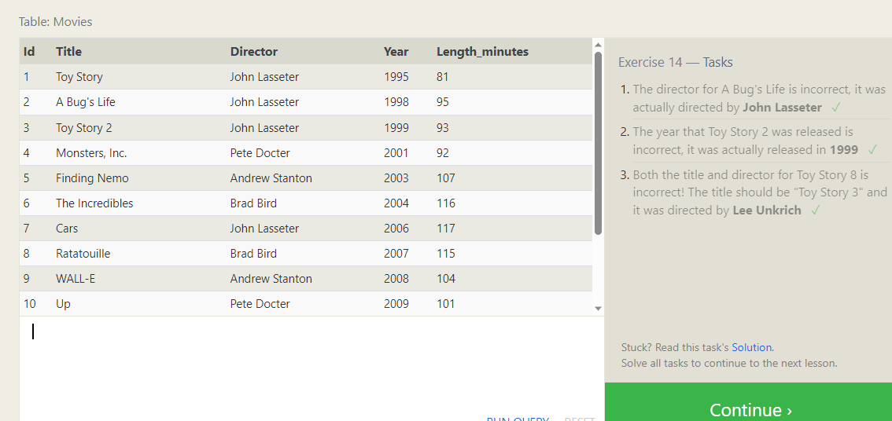
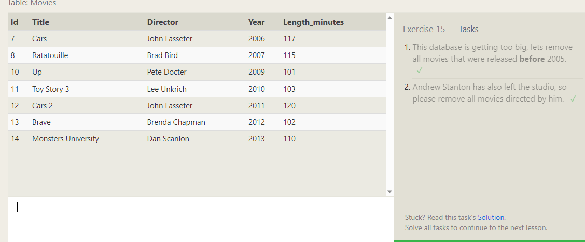
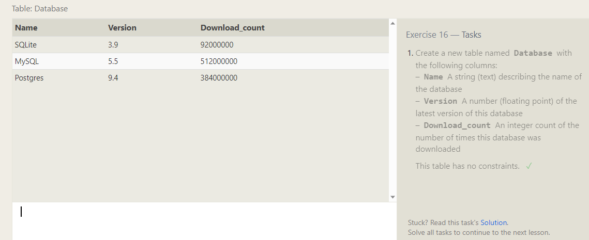
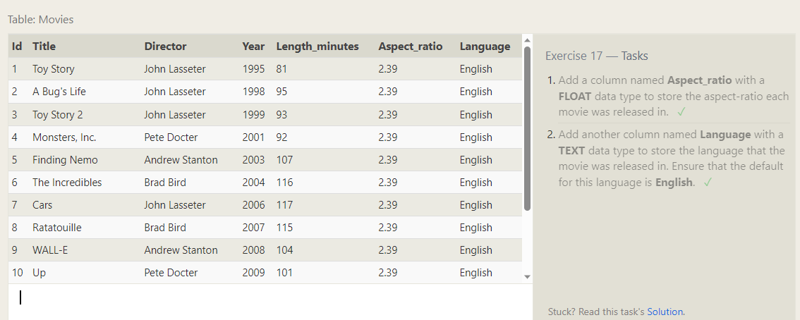

# reading-notes
Relational databases are a type of database system that is based on relational model and is used to organize and store data in tables. Each table has a set of columns that define the attributes of the data being stored, and each row represents a single instance of that data.

SQL (Structured Query Language) is a programming language used to communicate with relational databases. It is used to create, modify, and query relational databases to manipulate data stored in them. SQL is a standard language used across various database platforms, including MySQL, Oracle, and Microsoft SQL Server.

Some common tasks that can be performed using SQL with relational databases include:

1. Creating tables, databases, and relationships between tables
2. Inserting and updating data within tables
3. Retrieving data from tables using queries and filters
4. Sorting and aggregating data using SQL functions and operators
5. Modifying and deleting data from tables

SQL is an essential skill that is required for anyone working with relational databases. Understanding how to use SQL to interact with databases can help developers to create and maintain complex database systems and enables business analysts to extract insights from data.

-----------------------------

# sql

