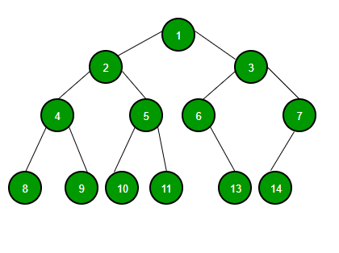
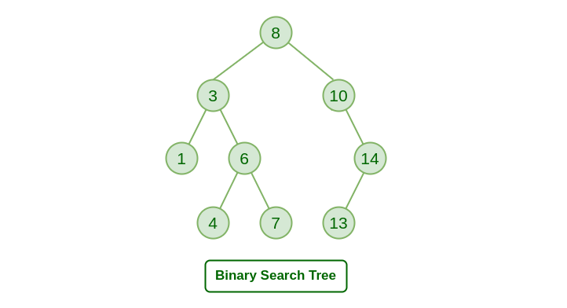

# Trees

### What is a Tree?
 A tree consists of a set of nodes connected by edges.The topmost node in a tree is called the root node, and each node has zero or more child nodes. Nodes that have no children are called leaf nodes. A path from the root node to a particular node is called a branch or a path. 
 ### Why we use trees?
1. Speed 
Trees offer quicker search, insertion, and deletion than other data structures, such as linked lists, because of their shorter depth.
2. Flexibility
Trees do not have a fixed size like arrays, so they can grow and shrink as needed, making them very flexible, especially when dealing with dynamic data sets. 
3. Space Efficiency
Trees only require extra space for pointers since each node only needs to store the address or reference of its child nodes, unlike arrays which require extra space for every single element even if some of those elements are not used yet.

### Types of Trees
 1. Binary tree:
   A Binary tree is represented by a pointer to the topmost node (commonly known as the “root”) of the tree. If the tree is empty, then the value of the root is NULL. Each node of a Binary Tree contains the following parts:

      * Data
      * Pointer to left child
      * Pointer to right child

    Basic Operation On Binary Tree:
      * Inserting an element.
      * Removing an element.
      * Searching for an element.
      * Traversing the tree.

2. Binary Search Tree:
A binary search tree (BST) is a binary tree where every node has a value greater than all the values in its left subtree and less than all the values in its right subtree. BSTs are used when quickly searching for a value in a large dataset is important.

The properties that separate a binary search tree from a regular binary tree is

   * All nodes of left subtree are less than the root node.
   * All nodes of right subtree are more than the root node.
   * Both subtrees of each node are also BSTs i.e. they have the above two properties.

1. K-ary Tree:A k-ary tree is a rooted tree in which each node has no more than k children. It is also sometimes known as a k-way tree, an N-ary tree, or an M-ary tree. A binary tree is the special case where k=2.

Types of k-ary trees:
* Types of k-ary trees.
* Types of k-ary trees.
* Types of k-ary trees.

